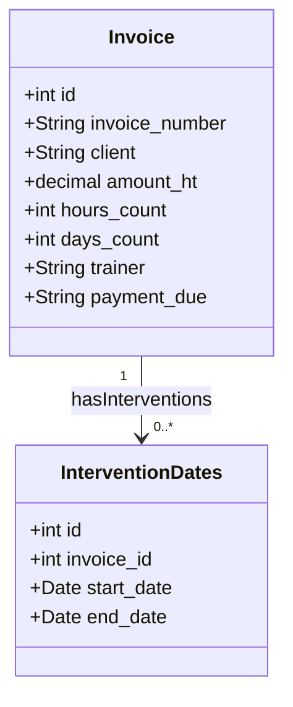

# RPA projet

## API Plateform

### Implémentation de l'API de gestion des factures

Dans ce TP, vous allez mettre en œuvre une API de gestion des factures pour une plateforme de gestion administrative. 

## Objectifs

- Mettre en place une API RESTful pour la gestion des factures.
- Implémenter différentes fonctionnalités pour récupérer des factures en fonction de différents critères tels que l'année, la date, le nom du formateur, le nom de l'école, etc.
- Tester l'API à l'aide d'outils tels que Postman ou curl.

1. Mise en place de l'environnement

Utilisez API platform

1. Modèle de données

Utilisez le fichier qui se trouve dans le dossier Data : [factures](./app-fastapi-rpa/db/invoices.json)

Modèle des données en SQL

Dans ce diagramme :

- `Facture` représente l'entité principale.
- Les attributs `- numero`, `- client`, `- montantHT`, `- nbHeures`, `- dateDebut`, `- dateFin`, `- formateur` et `- payerA` correspondent aux champs de la facture tels que spécifiés dans les données JSON.
- Les types de données sont tous des chaînes de caractères (`String`), car les valeurs dans les données JSON sont des chaînes de caractères.
- Les attributs sont définis comme privés (indiqués par le préfixe `-`) pour suivre une bonne pratique de l'encapsulation. Cela signifie qu'ils ne sont pas directement accessibles depuis l'extérieur de l'entité mais sont accessibles via des méthodes publiques si nécessaire.

1. Implémentation des endpoints

Implémentez les endpoints suivants pour récupérer les factures :

   1. `GET /invoices` : Récupère toutes les invoices.
   2. `GET /invoices/year/<annee>` : Récupère les factures pour une année spécifiée.
   3. `GET /invoices/date/<date>` : Récupère les factures pour une date spécifiée.
   4. `GET /invoices/trainer/<nom_formateur>` : Récupère les factures pour un formateur spécifié.
   5. `GET /invoices/school/<nom_ecole>` : Récupère les factures pour une école spécifiée.
   6. `GET /invoices/date/<date>/trainer/<name_trainer>` : Récupère les factures pour une date et un formateur spécifiés.
   7. `GET /factures/date/<date>/school/<name_school>` : Récupère les factures pour une date et une école spécifiées.
   8. `GET /factures/date/<date>/trainer/<name_trainer>/school/<name_school>` : Récupère les factures pour une date, un formateur et une école spécifiés.

1. Documentation

- Créez une documentation décrivant chaque endpoint, les paramètres acceptés et les réponses attendues.

## Livrables

- Code source de l'API.
- Documentation de l'API.
- Rapport décrivant les étapes de développement, les problèmes rencontrés et les solutions adoptées.
